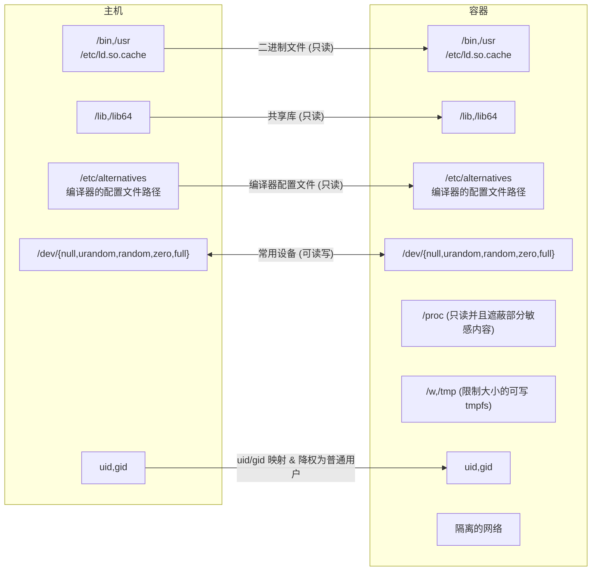

# 文件系统挂载

## 容器的文件系统



在 Linux 平台，默认只读挂载点包括主机的 `/lib`, `/lib64`, `/usr`, `/bin`, `/etc/ld.so.cache`, `/etc/alternatives`, `/etc/fpc.cfg`, `/dev/null`, `/dev/urandom`, `/dev/random`, `/dev/zero`, `/dev/full` 和临时文件系统 `/w`, `/tmp` 以及 `/proc`。

使用 `mount.yaml` 定制容器文件系统。

`/w` 的 `/tmp` 挂载 `tmpfs` 大小通过 `-tmp-fs-param` 指定，默认值为 `size=128m,nr_inodes=4k`

如果在容器的根目录存在 `/.env` 文件，那么这个文件会在容器创建时被载入。文件的每一行会作为环境变量的初始值加入到运行程序当中。

如果之后指定的挂载点目标在之前的挂载点之下，那么需要保证之前的挂载点存在目标文件或者文件夹。

## 自定义挂载

请将接下来的文件命名为 `mount.yaml` 并保存你的配置目录，然后为 `go-judge` 指定 `-mount-conf 你的配置目录/mount.yaml` 命令行参数启动。在添加配置后，请留意输出的 log 来确保配置文件生效。

:::code-group

```yaml [mount.yaml]
mount:
  # 基本配置
  - type: bind
    source: /bin
    target: /bin
    readonly: true
  - type: bind
    source: /lib
    target: /lib
    readonly: true
  - type: bind
    source: /lib64
    target: /lib64
    readonly: true
  - type: bind
    source: /usr
    target: /usr
    readonly: true
  - type: bind
    source: /etc/ld.so.cache
    target: /etc/ld.so.cache
    readonly: true
  # 有些编译器有多版本
  - type: bind
    source: /etc/alternatives
    target: /etc/alternatives
    readonly: true
  # fpc wants /etc/fpc.cfg
  - type: bind
    source: /etc/fpc.cfg
    target: /etc/fpc.cfg
    readonly: true
  # mono wants /etc/mono
  - type: bind
    source: /etc/mono
    target: /etc/mono
    readonly: true
  # ghc wants /var/lib/ghc
  - type: bind
    source: /var/lib/ghc
    target: /var/lib/ghc
    readonly: true
  # go wants /dev/null
  - type: bind
    source: /dev/null
    target: /dev/null
  # java 17 wants /etc/java-17-openjdk
  - type: bind
    source: /etc/java-17-openjdk
    target: /etc/java-17-openjdk
    readonly: true
  # node wants /dev/urandom
  - type: bind
    source: /dev/urandom
    target: /dev/urandom
  # additional devices
  - type: bind
    source: /dev/random
    target: /dev/random
  - type: bind
    source: /dev/zero
    target: /dev/zero
  - type: bind
    source: /dev/full
    target: /dev/full
  # work dir
  - type: tmpfs
    target: /w
    data: size=128m,nr_inodes=4k
  # tmp dir
  - type: tmpfs
    target: /tmp
    data: size=128m,nr_inodes=4k
  # MPI wants shm
  # - type: tmpfs
  #   target: /dev/shm
  #   data: size=64m,nr_inodes=4k
  # （可选）挂载 /etc/passwd 显示用户名，例子在特殊文件部分
  - type: bind
    source: containerPasswd.txt
    target: /etc/passwd
  # （可选） 挂载 /.env 加载自定义环境变量，例子在特殊文件部分
  - type: bind
    source: dotenv
    target: /.env
    #readonly: true
  # MPI wants /sys, readonly may not work for /sys
  # - type: bind
  #   source: /sys
  #   target: /sys
  #  # readonly: true
# java & ghc wants /proc/self/exe
proc: true
# procrw 给予 /proc 可读写权限，在特殊情况下需要。例如 CUDA
#procrw: true
# （可选） 创建常用软连接。如果留空，则默认配置如下
symLink:
  - linkPath: /dev/fd
    target: /proc/self/fd
  - linkPath: /dev/stdin
    target: /proc/self/fd/0
  - linkPath: /dev/stdout
    target: /proc/self/fd/1
  - linkPath: /dev/stderr
    target: /proc/self/fd/2
# （可选）遮蔽部分系统敏感文件。如果留空，则默认配置如下
maskPath:
  - /sys/firmware
  - /sys/devices/virtual/powercap
  - /proc/acpi
  - /proc/asound
  - /proc/kcore
  - /proc/keys
  - /proc/latency_stats
  - /proc/timer_list
  - /proc/timer_stats
  - /proc/sched_debug
  - /proc/scsi
  - /usr/lib/wsl/drivers
  - /usr/lib/wsl/lib
# 容器工作目录
workDir: /w
# 容器 host name
hostName: go-judge
# 容器 domain name
domainName: go-judge
# 容器用户 id
uid: 1536
# 容器用户组 id
gid: 1536
# MPI want network
# 在沙箱初始化之后额外执行的命令，例如接下来的命令时初始化容器本地回环网络
#initCmd: ip link set dev lo up
```

:::

### 特殊文件

:::code-group

```text [containerPasswd.txt]
root:x:0:0::/w:/bin/bash
go-judge:x:1536:1536::/w:/bin/bash
```

```text [dotenv]
# /.env 文件指定默认环境变量，每行一个
# 空行和 # 开始的注释会被忽略，不需要给环境变量加上双引号
TESTENV=true
```

:::