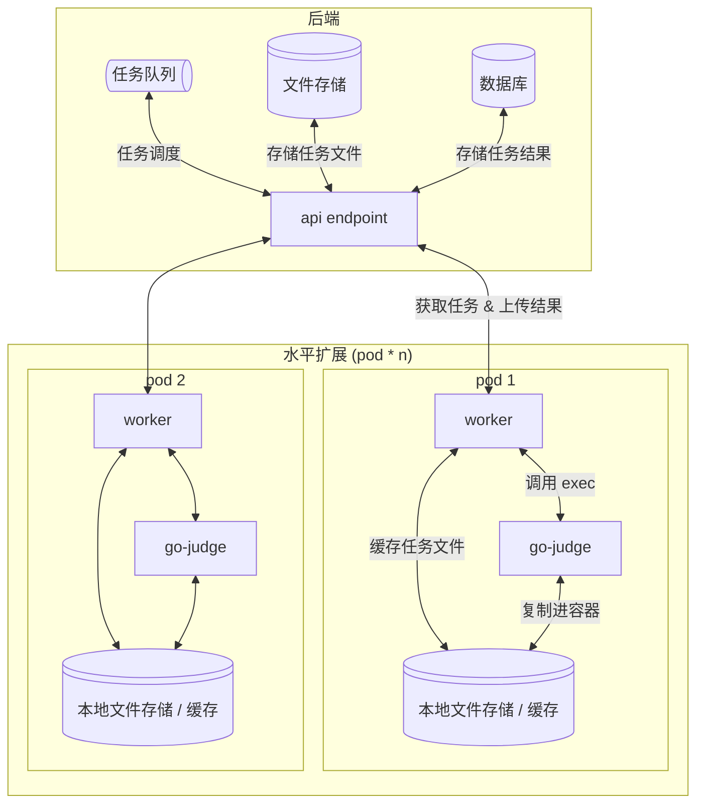

# 扩展

水平扩展系统架构例子

```mermaid
flowchart TB
    subgraph 后端
    api-endpoint[api endpoint]
    task-queue@{ shape: das, label: "任务队列" } <-- 任务调度 --> api-endpoint
    file-storage@{ shape: lin-cyl, label: "文件存储" } <-- 存储任务文件 --> api-endpoint
    database@{ shape: cyl, label: "数据库" } <-- 存储任务结果 --> api-endpoint
    end
    subgraph "水平扩展 (pod * n)"
    direction LR
    subgraph pod 1
    api-endpoint <-- 获取任务 & 上传结果 --> worker
    worker <-- 调用 exec --> go-judge
    A@{ shape: lin-cyl, label: "本地文件存储 / 缓存" }
    worker <-- 缓存任务文件 --> A
    go-judge <-- 复制进容器 --> A
    end
    subgraph pod 2
    w2[worker]
    g2[go-judge]
    api-endpoint <--> w2
    w2 <--> g2
    B@{ shape: lin-cyl, label: "本地文件存储 / 缓存" }
    w2 <--> B
    g2 <--> B
    end
    end
```
