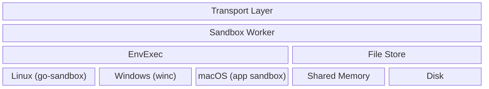
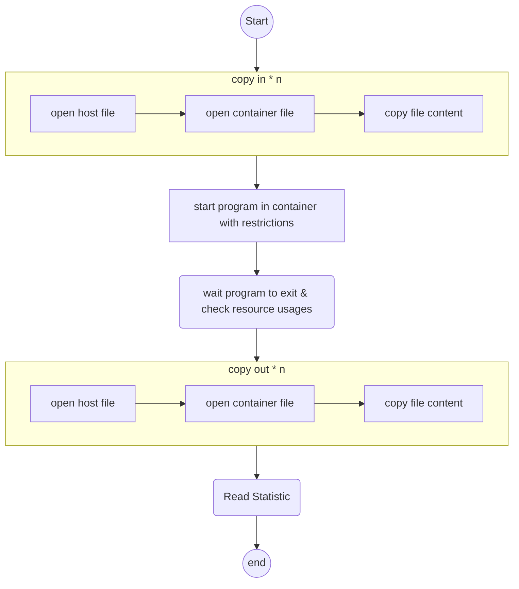
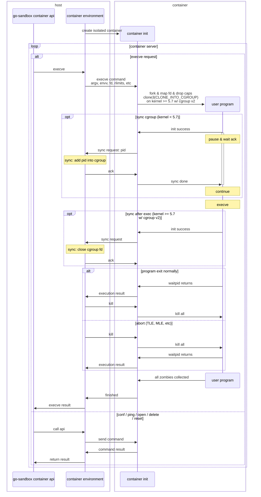

# Design

## Prerequisite

- Linux Kernel Version >= 3.10
- Cgroup file system mounted at /sys/fs/cgroup. Usually done by systemd

## Architecture



## Execution Workflow



## Return Status

- Accepted: Program exited with status code 0 within time & memory limits
- Memory Limit Exceeded: Program uses more memory than memory limits
- Time Limit Exceeded:
  - Program uses more CPU time than cpuLimit
  - Or, program uses more clock time than clockLimit
- Output Limit Exceeded:
  - Program output more than pipeCollector limits
  - Or, program output more than output-limit
- File Error:
  - CopyIn file is not existed
  - Or, CopyIn file too large for container file system
  - Or, CopyOut file is not existed after program exited
- Non Zero Exit Status: Program exited with non 0 status code within time & memory limits
- Signalled: Program exited with signal (e.g. SIGSEGV)
- Dangerous Syscall: Program killed by seccomp filter
- Internal Error:
  - Program is not exist
  - Or, container create not successful (e.g. not privileged docker)
  - Or, other errors

## Packages

- envexec: run single / group of programs in parallel within restricted environment and resource constraints
- env: reference implementation environments to inject into envexec

## Windows Support

- Build `go-judge` by: `go build ./cmd/go-judge/`
- Build `go_judge.dll`: (need to install `gcc` as well) `go build -buildmode=c-shared -o go_judge.so ./cmd/go-judge-ffi/`
- Run: `./go-judge`

### Windows Security

- Resources are limited by [JobObject](https://docs.microsoft.com/en-us/windows/win32/procthread/job-objects)
- Privilege are limited by [Restricted Low Mandatory Level Token](https://docs.microsoft.com/en-us/windows/win32/secauthz/access-tokens)
- Low Mandatory Level directory is created for read / write

## MacOS Support

- Build `go-judge` by: `go build ./cmd/go-judge/`
- Build `go_judge.dylib`: (need to install `XCode`) `go build -buildmode=c-shared -o go_judge.dylib ./cmd/go-judge-ffi/`
- Run: `./go-judge`

### MacOS Security

- `sandbox-init` profile deny network access and file read / write and read / write to `/Users` directory

## Notice

> [!WARNING]  
> Window and macOS support are experimental and should not be used in production environments

### cgroup usage

For cgroup v1, the `go-judge` need root privilege to create `cgroup`. Either creates sub-directory `/sys/fs/cgroup/cpuacct/gojudge`, `/sys/fs/cgroup/memory/gojudge`, `/sys/fs/cgroup/pids/gojudge` and make execution user readable or use `sudo` to run it.

For cgroup v2, systemd dbus will be used to create a transient scope for cgroup integration.

If no permission to create cgroup, the cgroup related limit will not be effective.

### cgroup v2 support

The cgroup v2 is supported by `go-judge` now when running as root since more Linux distribution are enabling cgroup v2 by default (e.g. Ubuntu 21.10+, Fedora 31+). However, for kernel < 5.19, due to missing `memory.max_usage_in_bytes` in `memory` controller, the memory usage is now accounted by `maxrss` returned by `wait4` syscall. Thus, the memory usage appears higher than those who uses cgroup v1. For kernel >= 5.19, `memory.peak` is being used.

When running in containers, the `go-judge` will migrate all processed into `/api` hierarchy to enable nesting support.

When running in Linux distributions powered by `systemd`, the `go-judge` will contact `systemd` via `dbus` to create a transient scope as cgroup root.

When running with kernel >= 5.7, the `go-judge` will try faster `clone3(CLONE_INTO_CGROUP)` method.

### Memory Usage

The controller will consume `20M` memory and each container will consume `20M` + size of tmpfs `2 * 128M`. For each request, it consumes as much as user program limit + extra limit (`16k`) + total copy out max. Notice that the cached file stores in the shared memory (`/dev/shm`) of the host, so please ensure enough size allocated.

For example, when concurrency = 4, the container itself can consume as much as `60 + (20+32) * 4M = 268M` + 4 * total copy out + total max memory of requests.

Due to limitation of GO runtime, the memory will not return to OS automatically, which could lead to OOM killer. The background worker was introduced to checks heap usage and invokes GC when necessary.

- `-force-gc-target` default `20m`, the minimal size to trigger GC
- `-force-gc-interval` default `5s`, the interval to check memory usage

## Benchmark

By `wrk` with `t.lua`: `wrk -s t.lua -c 1 -t 1 -d 30s --latency http://localhost:5050/run`.

However, these results are not the real use cases since the running time depends on the actual program specifies in the request. Normally, the go judge consumes ~1ms more compare to running without sandbox.

```lua
wrk.method = "POST"
wrk.body   = '{"cmd":[{"args":["/bin/cat","a.hs"],"env":["PATH=/usr/bin:/bin"],"files":[{"content":""},{"name":"stdout","max":10240},{"name":"stderr","max":10240}],"cpuLimit":10000000000,"memoryLimit":104857600,"procLimit":50,"copyIn":{"a.hs":{"content":"main = putStrLn \\"Hello, World!\\""},"b":{"content":"TEST"}}}]}'
wrk.headers["Content-Type"] = "application/json;charset=UTF-8"
```

- Single thread ~800-860 op/s Windows 10 WSL2 @ 5800X
- Multi thread ~4500-6000 op/s Windows 10 WSL2 @ 5800X

Single thread:

```text
Running 30s test @ http://localhost:5050/run
  1 threads and 1 connections
  Thread Stats   Avg      Stdev     Max   +/- Stdev
    Latency     1.16ms  132.89us   6.20ms   90.15%
    Req/Sec     0.87k    19.33     0.91k    85.33%
  Latency Distribution
     50%    1.13ms
     75%    1.18ms
     90%    1.27ms
     99%    1.61ms
  25956 requests in 30.01s, 6.88MB read
Requests/sec:    864.88
Transfer/sec:    234.68KB
```

## go-sandbox Container Protocol


