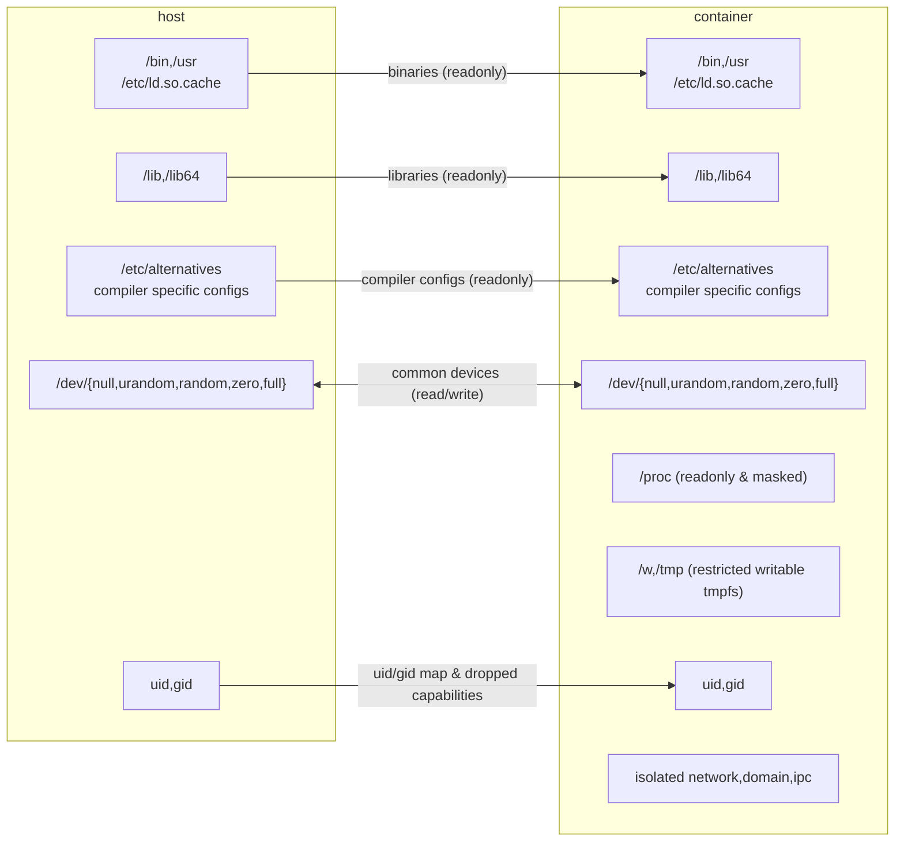

# File System Mount

## Container Root File System



On Linux platform, the default mounts points are bind mounting host's `/lib`, `/lib64`, `/usr`, `/bin`, `/etc/ld.so.cache`, `/etc/alternatives`, `/etc/fpc.cfg`, `/dev/null`, `/dev/urandom`, `/dev/random`, `/dev/zero`, `/dev/full` and mounts tmpfs at `/w`, `/tmp` and creates `/proc`.

To customize mount points, please look at example `mount.yaml` file.

`tmpfs` size for `/w` and `/tmp` is configured through `-tmp-fs-param` with default value `size=128m,nr_inodes=4k`

If a file named `/.env` exists in the container rootfs, the container will load the file as environment variable line by line.

If a bind mount is specifying a target within the previous mounted one, please ensure the target exists in the previous mount point.

## Customization

Please save the `mount.yaml` in your configuration directory, and add `-mount-conf conf_dir/mount.yaml` to the command line argument of `go-judge`. After the configuration, you should check the log output to make sure the configuration is effective.

:::code-group

```yaml [mount.yaml]
mount:
  # Basic binaries and libraries
  - type: bind
    source: /bin
    target: /bin
    readonly: true
  - type: bind
    source: /lib
    target: /lib
    readonly: true
  - type: bind
    source: /lib64
    target: /lib64
    readonly: true
  - type: bind
    source: /usr
    target: /usr
    readonly: true
  - type: bind
    source: /etc/ld.so.cache
    target: /etc/ld.so.cache
    readonly: true
  # Some compiler have multiple versions
  - type: bind
    source: /etc/alternatives
    target: /etc/alternatives
    readonly: true
  # fpc wants /etc/fpc.cfg
  - type: bind
    source: /etc/fpc.cfg
    target: /etc/fpc.cfg
    readonly: true
  # mono wants /etc/mono
  - type: bind
    source: /etc/mono
    target: /etc/mono
    readonly: true
  # ghc wants /var/lib/ghc
  - type: bind
    source: /var/lib/ghc
    target: /var/lib/ghc
    readonly: true
  # go wants /dev/null
  - type: bind
    source: /dev/null
    target: /dev/null
  # java 17 wants /etc/java-17-openjdk
  - type: bind
    source: /etc/java-17-openjdk
    target: /etc/java-17-openjdk
    readonly: true
  # node wants /dev/urandom
  - type: bind
    source: /dev/urandom
    target: /dev/urandom
  # additional devices
  - type: bind
    source: /dev/random
    target: /dev/random
  - type: bind
    source: /dev/zero
    target: /dev/zero
  - type: bind
    source: /dev/full
    target: /dev/full
  # work dir
  - type: tmpfs
    target: /w
    data: size=128m,nr_inodes=4k
  # tmp dir
  - type: tmpfs
    target: /tmp
    data: size=128m,nr_inodes=4k
  # MPI wants shm
  # - type: tmpfs
  #   target: /dev/shm
  #   data: size=64m,nr_inodes=4k
  # (optional) bind a /etc/passwd to show customized user name. See special files below for examples
  - type: bind
    source: containerPasswd.txt
    target: /etc/passwd
  # (optional) bind a /.env to load default environment variable for the container. See special files below for examples
  - type: bind
    source: dotenv
    target: /.env
    #readonly: true
  # MPI wants /sys, readonly may not work for /sys
  # - type: bind
  #   source: /sys
  #   target: /sys
  #  # readonly: true
# java & ghc wants /proc/self/exe
proc: true
# procrw enables read-write permission on /proc for special usage like CUDA
#procrw: true
# (optional) create /dev standard io. Default value as follows if empty
symLink:
  - linkPath: /dev/fd
    target: /proc/self/fd
  - linkPath: /dev/stdin
    target: /proc/self/fd/0
  - linkPath: /dev/stdout
    target: /proc/self/fd/1
  - linkPath: /dev/stderr
    target: /proc/self/fd/2
# (optional) mask mounted paths with empty / null mount. Default value as follows if empty
maskPath:
  - /sys/firmware
  - /sys/devices/virtual/powercap
  - /proc/acpi
  - /proc/asound
  - /proc/kcore
  - /proc/keys
  - /proc/latency_stats
  - /proc/timer_list
  - /proc/timer_stats
  - /proc/sched_debug
  - /proc/scsi
  - /usr/lib/wsl/drivers
  - /usr/lib/wsl/lib
# container work directory
workDir: /w
# container host name
hostName: go-judge
# container domain name
domainName: go-judge
# container user uid
uid: 1536
# container user gid
gid: 1536
# MPI want network
# init cmd does additional setups. For example, the following command initialized the loopback network in container
#initCmd: ip link set dev lo up
```

:::

### Special Files

:::code-group

```text [containerPasswd.txt]
root:x:0:0::/w:/bin/bash
go-judge:x:1536:1536::/w:/bin/bash
```

```text [dotenv]
# /.env file should contain environment variable line by line
# empty line or line start with # are ignored
# double quote is not parsed and should not be used
TESTENV=true
```

:::