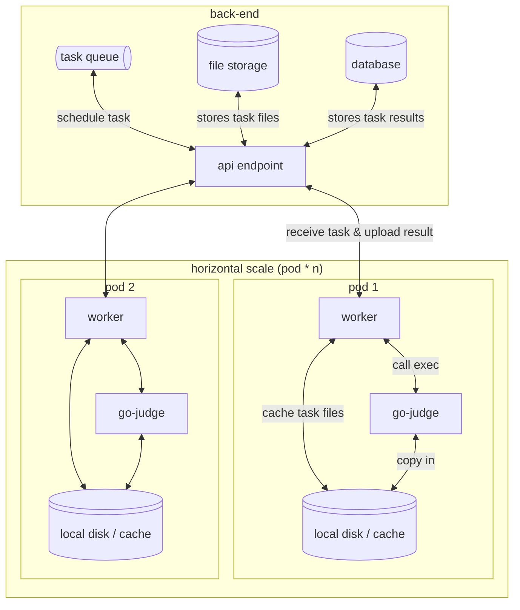

# Scale

Example system architecture for scaling in production

```mermaid
flowchart TB
    subgraph back-end
    api-endpoint[api endpoint]
    task-queue@{ shape: das, label: "task queue" } <-- schedule task --> api-endpoint
    file-storage@{ shape: lin-cyl, label: "file storage" } <-- stores task files --> api-endpoint
    database@{ shape: cyl, label: "database" } <-- stores task results --> api-endpoint
    end
    subgraph "horizontal scale (pod * n)"
    direction LR
    subgraph pod 1
    api-endpoint <-- receive task & upload result --> worker
    worker <-- call exec --> go-judge
    A@{ shape: lin-cyl, label: "local disk / cache" }
    worker <-- cache task files --> A
    go-judge <-- copy in --> A
    end
    subgraph pod 2
    w2[worker]
    g2[go-judge]
    api-endpoint <--> w2
    w2 <--> g2
    B@{ shape: lin-cyl, label: "local disk / cache" }
    w2 <--> B
    g2 <--> B
    end
    end
```
